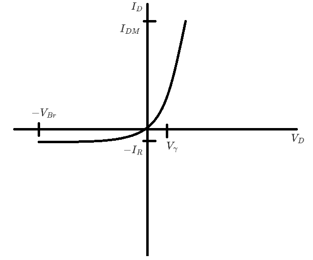
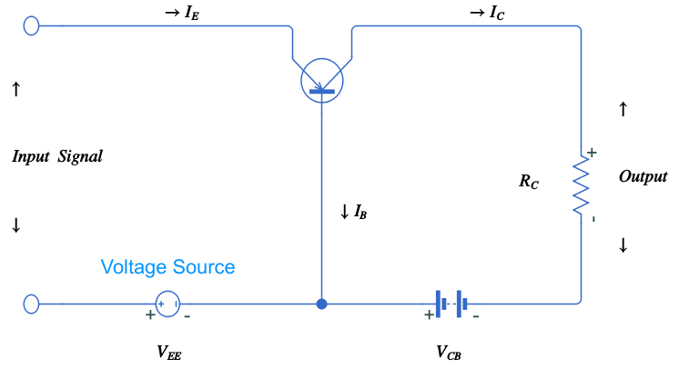
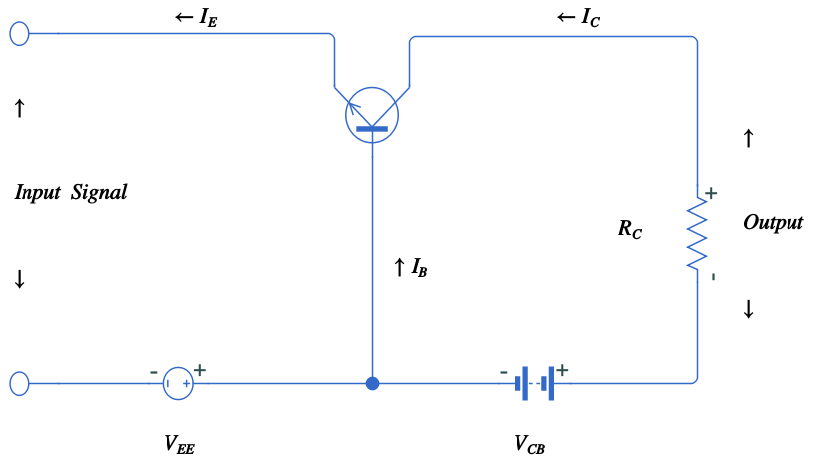
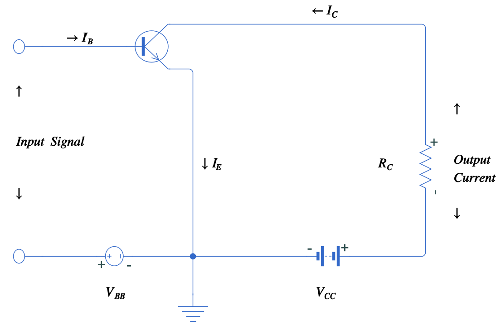
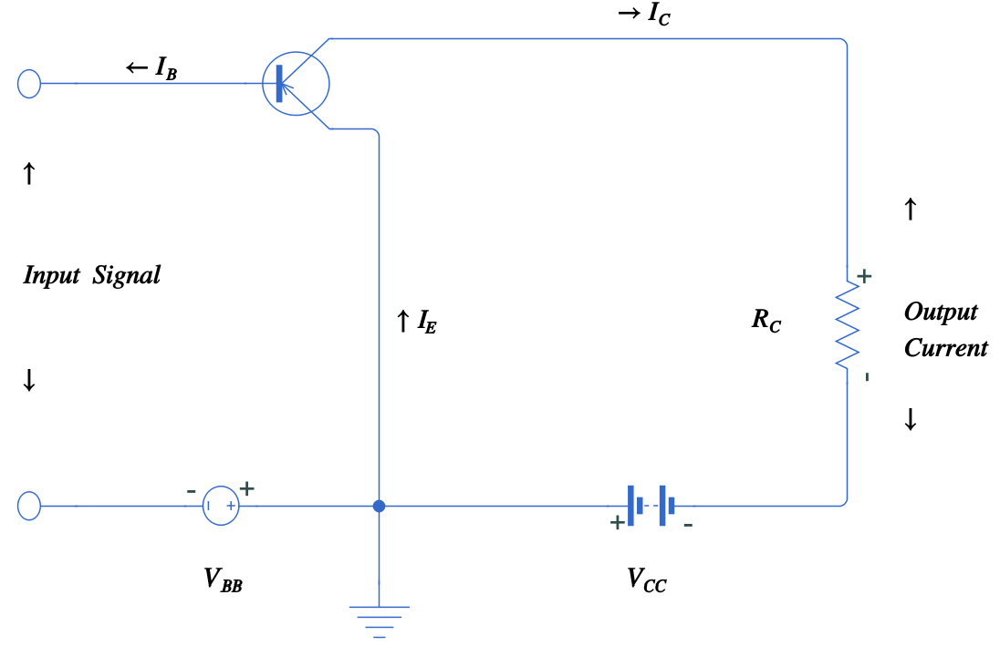
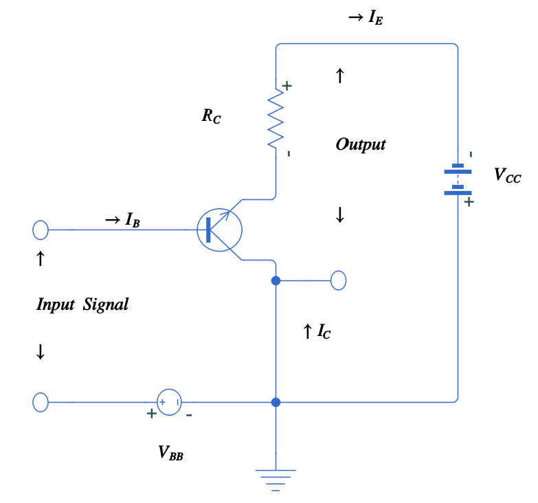
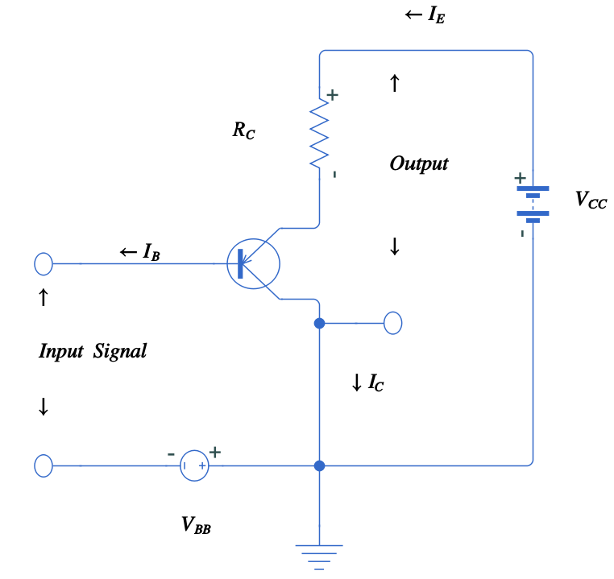

# Electronics foundation

## How electricity works ?

* [Does Electricity REALLY Flow? (Electrodynamics) - YouTube](https://hitechcircuits.com/pt/)
* [How Electricity Actually Works - YouTube](https://www.youtube.com/watch?v=oI_X2cMHNe0&t=1320s&ab_channel=Veritasium)

## Diodes and transistors

### Diode specifications

* Direct polarization

  * In this case, the direct polarization voltage must be equal or greater than the potential barrier

    

$$
V_D \ge V_\gamma
$$

* The relationship between current and power dissipated is equal to

  
  $$
  P_{MD}=V_{D}I_{DM}
  $$

The following graph shows the relationship between the voltage and current limits in a diode.

As observed, as the voltage increase so does the current, but exponentially, reaching it's maximum value which is supported by material properties only. In the presence of reverse polarization, the diode still conduct current until reach the minimum voltage value, if the voltage decrease below the rupture voltage, the diode works as an open circuit.

## Transistors specifications

There are many [configurations](https://www.youtube.com/watch?v=pQKCrpBnA2w&ab_channel=5Volts) for a transistor

* Common base PNP

  

  As showing above, we must feed a direct polarization in the input terminals and a reverse polarization in the output load to create a low impedance and high impedance, respectively,  this will also allow us to use the transistor PNP in the linear range of operation. Since almost all the current from emitter terminal will flow through collector terminal, a tiny portion will flow through the base terminal. Therefore, we will have a gain in voltage from the input to output perspective. On the other hand, the gain in current is equal to or below one, because the emitter current is equal to the collector current plus the base current, thus, the collector current is less than the emitter current. Therefore, as base current decreased, collector current approach the emitter current. In conclusion, the gain of power is median, because we have a large gain of voltage but a little gain in current.

* Common base NPN

  

  

  As showing above, we must feed a reverse polarization in the input terminals and a direct polarization in the output load to create a high impedance and low impedance, respectively. The analysis are the same as before, only the signals of the currents and voltages has changed.

* Common emitter NPN

  

  It is commonly used as a electronic switch or an amplification device. The input signal will direct polarize the base-emitter junction and the output will be in reverse configuration. This configuration will allow us to have a voltage gain and current, therefore, we will have a large power gain.  Although, we also have an inversion in phase in this configuration, because as the base current increase, the voltage drop between the collector and emitter terminals will decrease, since the transistor in the active region works as a variable resistor, as we increase the base current the resistance will decrease, and the voltage drop between collector and emitter terminal will also decrease with respect to a reference.  

* Common emitter PNP

The analysis is the same as before, only the signals of the currents and voltages has changed.

* Common collector NPN

  

  In this configuration we have the collector common to its input and output signals. As observed, we have a high impedance at the input signal and a low impedance at the output signal as your main characteristic, which leave us with a high gain in current but low voltage gain. It is commonly used in the input of amplifiers because we have almost zero current being drained by the base terminal. And the output can be cascade with others circuits to improve impedance as we needed.

* Common Collector PNP

  

  The analysis is the same as before, only the signals of the currents and voltages has changed.

  ## Introduction to circuits logic
  
  

