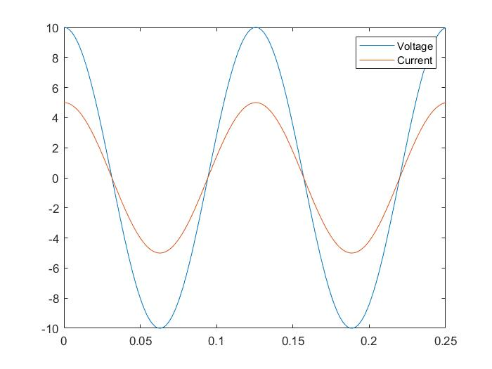
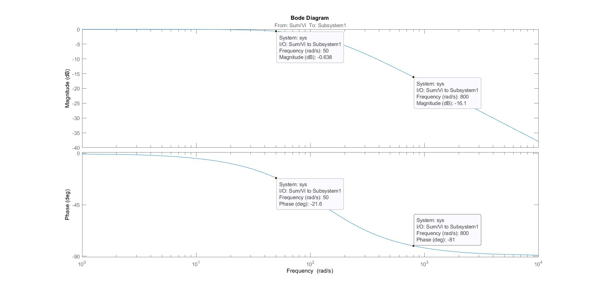

# Basic circuit principles

## Passive elements

* Resistor, the current and voltage characteristic is given by

$$
V=iR
$$

* Capacitor,

$$
i = C\frac{dV}{dt}
$$

* Inductor,

$$
V = L\frac{di}{dt}
$$

## Series and parallel connections

* Resistor

  * Series

    
    $$
    R = R_1+R_2+...+R_n
    $$

  * Parallel

    
    $$
    R=\frac{1}{\frac{1}{R_1} + \frac{1}{R_2}+...+ \frac{1}{R_n}}
    $$

* Inductors

  * Series

    
    $$
    L = L_1 + L_2 +...+L_n
    $$

  * Parallel

    
    $$
    L=\frac{1}{\frac{1}{L_1} + \frac{1}{L_2}+...+ \frac{1}{L_n}}
    $$

* Capacitors

  * Series

    
    $$
    C=\frac{1}{\frac{1}{C_1} + \frac{1}{C_2}+...+ \frac{1}{C_n}}
    $$

  * Parallel

    
    $$
    C=C_1+C_2+...+C_n
    $$

## Connections and Sources

* Ground: reference for 0 volts
* Node: Voltage level the same everywhere on the node
* Voltage/Current source: independent or dependent

## Kirchhoff's Voltage Law (KVL)

* The sum of voltages around any closed loop is zero
* If you encounter a plus signal you should add, otherwise subtract

## Kirchhoff's Current Law (KCL)

* The sum of current entering a node is equal to the sum of current leaving

## Impedance

* Resistor voltage and current behavior

  
  $$
  Z_r=R
  $$
  

  

  * They are in phase

  * Therefore, frequency invariant

    Remember

    
    $$
    f(Hz)=\frac{1}{T}
    $$

    $$
    \omega(rad/s)=2\pi f=\frac{2\pi}{T}
    $$

* Capacitor voltage and current behavior

  
  $$
  Z_C=\frac{1}{j\omega C}
  $$
  

  * Current leads voltage (comes before)

* Inductor voltage and current behavior

  
  $$
  Z_L=j\omega L
  $$
  

  * ​	Current lags voltage (comes after)

### Impedance in series

$$
Z_eq=Z_1+Z_2+...+Z_n
$$

### Impedance in parallel

$$
Z_{eq}=[\frac{1}{Z_1}+\frac{1}{Z_1}+...+\frac{1}{Z_n}]^{-1}
$$

## Transfer functions

* Two-port network case

  
  $$
  V_i(t)=A_{in}cos(\omega t+\theta_{in})
  $$

  $$
  V_o(t)=A_{out}cos(\omega t+\theta_{out})
  $$

* In this case the input is sinusoidal and in the steady state the output is also sinusoidal

* Also, has the same frequency but different amplitude and phase

  
  $$
  V_i=A_{in}\angle{\theta_{in}}
  $$

  $$
  V_o=A_{out}\angle\theta{out}
  $$

* Transfer function is a relationship between output and input

  
  $$
  H(\omega)V_i=V_o
  $$

  $$
  H(\omega)A_{in}\angle\theta{in}=A_{out}\angle\theta{out}
  $$

* If we take the magnitude for both sides

  
  $$
  A_{out}=|{H(\omega)}|A_{in}
  $$

  $$
  \theta_{out}=\angle H(\omega) + \theta_{in}
  $$

## Summary of simple circuits transfer functions

* Resistor, capacitor circuit

$$
H(\omega)=\frac{1}{1+RC\omega j}
$$

* Capacitor, resistor circuit

$$
H(\omega)=\frac{RC\omega j}{1+RC\omega j}
$$

* Resistor, inductor, capacitor circuit

$$
H(\omega)=\frac{1}{1-\omega^2 LC + RC\omega j}
$$

## Frequency response plots

* Frequency response is the magnitude vs omega, for instance, a RC circuit has magnitude of

$$
|H(\omega)|=\frac{1}{1+(RC\omega)^2}
$$

* That's it, the magnitude is given by

  
  $$
  |H(\omega)|=|\frac{1}{a + bj}|=\frac{1}{\sqrt{a^2 + b^2}}
  $$

* In the bode diagram, the magnitude has units of decibels (dB), and has the following relationship

  
  $$
  H(dB)=20log(|H(\omega)|)
  $$

* also, omega is in the log scale

* The angle vs omega is given by

  
  $$
  \angle \frac{1}{a+bj} =-atan(\frac{b}{a})=-tan(RC\omega)
  $$

* The transfer function shows how a circuit processes signals of different frequencies

## Circuit response study case

Given the following input voltage

$$
V_i=cos(50t)+cos(800t)
$$

find R and C for the following circuit, such as

$$
V_o=0.95cos(50t -20^\circ) + 0.13cos(80t -85^\circ)
$$

Using matlab and simulink parameter estimator, we find R =  228.5176 and C = 3.4629e-05.

The given bode diagram in linear scale is founded to be almost the needed values, numerical computations requires more analysis to reach the needed values of magnitude 0.95 at 50 rad/s and 0.13 at 800 rad/s and phase angle -20° at 50 rad/s and -85° at 800 rad/s.

## BODE diagram

A bode diagram is actually given in log scales units, as showing as follow, where
$$
|H(\omega)|(dB)=20log(|H(\omega)|)
$$
