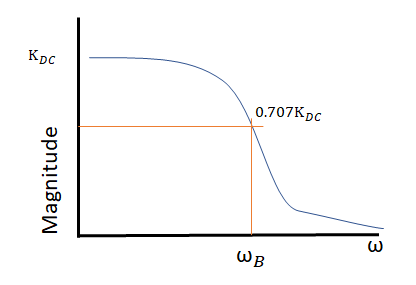
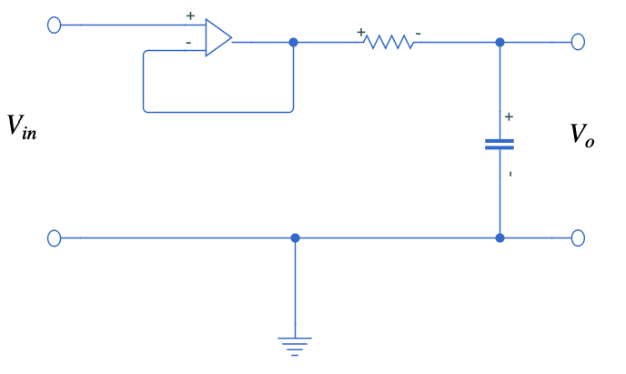
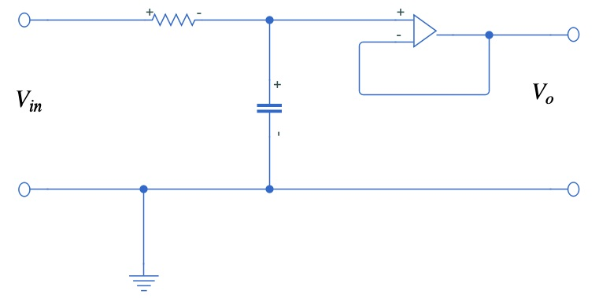
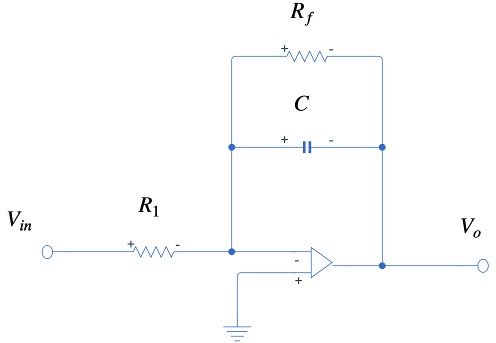
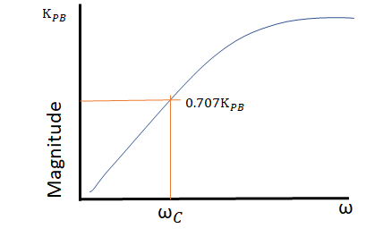

# First-order lowpass filters

* Pass low frequency and attenuate high frequency components
* It has a bandwidth,  $\omega_B$, it is a frequency value where the DC gain is about 70.7% in the linear plot
* Or it is the frequency where the magnitude is 3 dB below its $20log_{10}(K_{DC})$ DC value in the bode plot
* The bandwidth is the limit between the pass band and the stop band
* Or it is the frequency where the signals starts to get attenuated
* The $K_{DC}$ is the gain at 0 Hz

A first-order lowpass filter has the following transfer function
$$
H(\omega)=K_{DC}\frac{1}{\tau{j}{\omega} + 1}
$$
where $\omega=\frac{1}{\tau}$

You can have passive filter build up from a series resistor and capacitor configuration. But in order to isolate the input and output, a buffer circuit is used.

* Input isolation

* Output isolation

An alternative way to build up a lowpass filter it is to put the filter into the feedback loop. Its isolate both the input and output, and also has a DC gain different then one.

* Low pass filter into feedback loop

The circuit has the following output to input relationship, you can derive this expression using impedance characteristics 
$$
V_o=-\frac{R_f}{R_1}\frac{1}{R_f{Cj\omega} + 1}V_{in}
$$

# First-order highpass filters

* Pass high frequency and attenuate low frequency components
* It complete eliminates DC component at 0 Hz
* It has a corner frequency, $\omega_C$, it is a frequency value where the DC gain is about 70.7% in the linear plot
* In this filter, when $\omega$ goes to infinite $H(\omega)$ is equal to the passband gain, or $K_{PB}=H(\infty)$

A first-order highpass filter has the following transfer function
$$
H(\omega)=\frac{Kj\omega}{\tau{j}\omega + 1}
$$
where, $\omega_C=\frac{1}{\tau}$ and the passband gain is  $K_{PB}=\frac{K}{\tau}$

# Cascaded first-order filter

