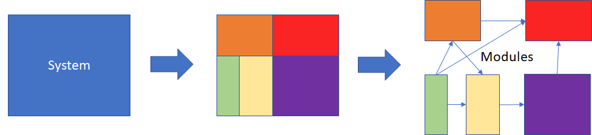

# Introduction to software engineering

## Dealing with the complexity

### Software complexity comes from

* Application Domain
* Communication among stakeholders
* Management of large software development projects
* Coding software

### Software complexity leads to

1. Software quality problems
   * [Unreliable](https://www.youtube.com/watch?v=72KES9VcnV0)
   * [Unsafe](https://www.youtube.com/watch?v=VXjOKWdgYtc&ab_channel=MasakiOkamoto)
   * Abandoned
   * Inflexible (hard to change/maintain)

2. Software development problems
   * Over schedule and over budget
   * Does not meet user requirements
   * Development of working code is slower than expected
   * Progress is difficult to measure

### Dealing with complexity: Design goals

* Clearly understand the client's design goals
* Prioritize the design goals for a given project
* Base the development around these goals

Remember: There are many desirable softwares quality characteristics and it's often impossible (or unnecessary) to achieve all of them simultaneously. Therefore, having clear design goals reduces the complexity of designing the system.

### Dealing with complexity: Modular and Incremental development

Modules need to interact with others and they are consider separately.

When using modules we must assure that:

* Modules only interact via interfaces
* An interface abstracts and encapsulates a module thereby providing information hiding

Therefore, we only have to deal with the interface (*abstraction*) and if we need to modify something in the module, we don't have to touch the other modules (*encapsulation*).

### Dealing with complexity: Training software engineers

A software engineer needs to be able to:

* Talk with users in terms of the application
* Translate needs (agreed expectation) into requirements (agreed obligation)
* build models of a system at different levels of abstraction (i.e., for communication purpose)
* Use and apply several software development processes
* Choose among design alternatives (i.e., make design tradeoffs studies)

## What is software engineering

Software engineering it is a disciplined development effort in order to provide some quality product or service. It solves real user problem, requires a team effort and it is not a "one time" development effort, we have versions and we need to keep track different versions of the software. In order to do that we tried to solve questions along the way.

Common questions:

* How can i help the customer?
* What is required to solve the customer's problem?
* How will the user interact with the system?
* What operating system, language, hardware is going to be used?
* What is the overall software system structure?
* How do different components interact with each other?
* How do i organize my team so we are effective?

For this purpose you have to interact with

* Customers who asking for the system
* People who use the system
* Domain experts
* Engineers from other engineering disciplines
* Most closely with the other engineers on the project

Software engineering is not only about project management and communication. But it's not about coding either. Software engineers it's different from computer scientist, computer scientists want to understand the algorithms, and the foundation of computing theory.

> Software engineers want to learn the design principles and best practices for building quality software systems.

Computers scientists want to know how the basic technology works and where to improve it.

> Software engineers want to know the characteristics of the technologies so they can design the most appropriate technology into their software systems.

### Software engineering involves

* A modeling activity
  * Models the user requirements
  * Models the system to be built
  * Those two have to match

* Problem solving activity
  * Search for the appropriate solution in the presence of change
  * It is not an algorithmic, should be systematic
* Knowledge acquisition activity
  * Not a linear process, learn as you go, but may need to unlearn
  * Sometimes, you may even need to start over
* A rationale management activity
  * Our assumptions and solution change due to bugs or technology, for instance
  * Thus, we may need to revisit decisions
  * It's important that we document all the decision making process

## Summary

* Dealing with software development complexity requires
  * having appropriate design goals
  * using modular and incremental development techniques
  * using effective software engineering techniques

* From a technical viewpoint, software development consists of
  * software engineering (i.e., modeling and documenting system requirements and solutions - "programming in the large")
  * coding (i.e., building the system - "programming in the small")

​	