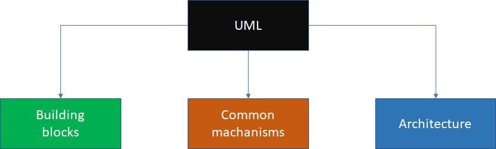

# Moddeling software systems using UML

## What is the [UML](https://www.tutorialspoint.com/uml/index.htm) ?

A software system can be modeled as a collection of collaborating objects. An UML structure is comprised by

* Building blocks has
  * things
  * realationships
  * diagrams
* The commom mechanisms are
  * specifications
  * adornments
  * commom divisions
  * extensibility mechanims
* And the architecture has the following
  * use-case view
  * logical view
  * implementation view
  * process view
  * deployment view
  * and so on

## Why do we build models?

* For communication purpose
  * To make sure that all the stakeholders have the same idea in their mind
* Model abstract reality
  * by showing essentials details and filter out non-essential details
  * those models allow us to focus on the "big picture"
  * help us to deal with the complexity of software development
    * i.e., by generating source code automatically
  * It results in a better understanding of requirements, cleaner designs, and more maintainable systems

## Why object-oriented modeling ?

* It allows direct representation of "things" in an application domain
* Reduces the "semantic gap" between the application domain and the model
* It better represent how people think about reality
  * An application domain is modeled as a collection of objects

## OO modeling and levels of abstraction

### Requirement level

* [Construct a requirement model](https://www.mathworks.com/help/slrequirements/)
  * Do not consider any aspects of the implementation domain of objects
  * Focus on identifying objects (concepts) in the application domain

### Analysis and design level

* [Construct a solution model](https://www.mathworks.com/help/physmod/simscape/)
  * Consider interfaces of objects (but no internal aspects)
  * Focus on how objects interact in the solution

### Implementation level

* [Implement the solution model](https://www.mathworks.com/help/dsp/c-code-generation.html?s_tid=CRUX_lftnav)
  * Consider all details of objects (external and internal)
  * Focus on how to code objects

